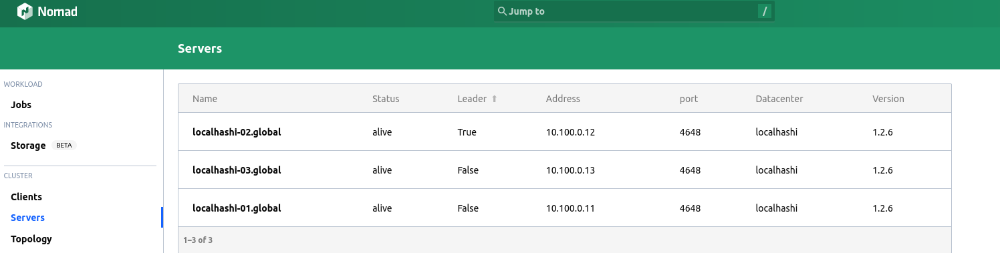
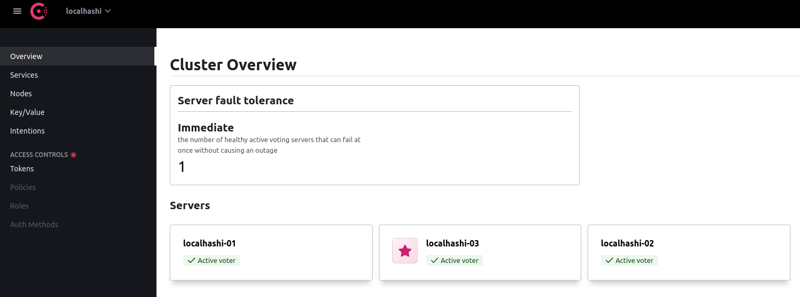

# localhashi

A local "Hashistack" lab suitable for experimenting with Nomad deployments. Spins up Nomad and Consul in Vagrant machines which can be used for local development purposes.

- [localhashi](#localhashi)
  - [Overview](#overview)
    - [But `-dev` mode exists](#but--dev-mode-exists)
  - [Running](#running)
    - [Prerequisite](#prerequisite)
    - [Environment Variables](#environment-variables)
      - [Gossip Encryption](#gossip-encryption)
      - [ACL](#acl)
    - [Spawn a single node](#spawn-a-single-node)
    - [Spawn a cluster](#spawn-a-cluster)
    - [Destroying nodes](#destroying-nodes)
  - [Networking](#networking)
    - [Single Node](#single-node)
    - [Cluster](#cluster)
  - [Advanced Usage](#advanced-usage)
    - [Configure ACL](#configure-acl)
  - [Addons](#addons)
    - [Docker Registry](#docker-registry)
      - [Running the registry](#running-the-registry)
      - [Pushing images](#pushing-images)
  - [References](#references)
  - [LICENSE](#license)

## Overview

NOTE: `hashistack` here refers to set of components running on a VM. Multiple such VMs can run and form a cluster. Currently the stack consists of:

- [Nomad](https://www.nomadproject.io/)
- [Consul](https://www.consul.io/)
- [Docker](https://www.docker.com/)

`localhashi` is a set of Ansible playbooks used to deploy `hashistack` on a Vagrant VM. These playbooks download, configure and setup services for Nomad, Consul. In addition to this, there are "addons", which are a bunch of utility deployments done to improve the development experience.

There are 2 different ways to setup the lab:

- `single`: The simplest way is a `single` node which spawns a single VM of `hashistack`.

- `cluster`: It spawns a 3 node `hashistack` cluster. Nomad and Consul run in `server` and `client` mode. This mode can be helpful in experimenting with more sophisticated scheduling patterns, testing multiple replicas across of your application across multiple nodes etc.

### But `-dev` mode exists

`nomad` and `consul` both come with a stateless `-dev` mode that act as a super quick way to get started with either of them. However, since they don't persist any state across runs, they are not useful for long standing development environments. Besdies that, you may sometimes want to tweak the client/server config of Nomad/Consul, so an opinionated setup which configures these things _similar_ to a production environment _out of the box_ is useful, IMHO.

## Running

### Prerequisite

- Install the following dependencies before you proceed:

  - [Vagrant](https://www.vagrantup.com/docs/installation)
  - [Ansible](https://docs.ansible.com/ansible/latest/installation_guide/intro_installation.html)

- If you wish to use `nomad` and `consul` CLI from your machine, you can grab the binaries from:

  - [Nomad](https://www.nomadproject.io/downloads)
  - [Consul](https://www.consul.io/downloads)

- Clone the repo locally:

```bash
git clone git@github.com:mr-karan/localhashi.git
```

- Create the following file: `/etc/vbox/networks.conf` with the following contents:

```
* 10.100.0.0/24
```

### Environment Variables

```
$ cp env.sample .env
```

#### Gossip Encryption

- For `CONSUL_ENCRYPT_KEY`, you can generate with: `consul keygen`
- For `NOMAD_ENCRYPT_KEY`, you can generate with: `nomad operator keygen`

#### ACL

ACL is by default disabled. However, if you wish to use ACL (refer to [ACL instructions](#configure-acl)), you can generate a UUIDv4 and set them as token values. Here's a `python` snippet of the same:

```python
import uuid
uuid.uuid4()
UUID('a285a289-ade0-4394-a91b-4bef349f3f68')
```

### Spawn a single node

- Run `make up-single` and wait for Vagrant to finish the provisioning process. It may take 3-5 minutes to complete.

- View the status of your node with:

```bash
$ consul members
Node        Address            Status  Type    Build   Protocol  DC          Partition  Segment
localhashi  10.100.0.100:8301  alive   server  1.12.0  2         localhashi  default    <all>

$ nomad node status
ID        DC          Name        Class   Drain  Eligibility  Status
e11945a7  localhashi  localhashi  <none>  false  eligible     ready
```

- You can open the following links in your browser to open the UI of Nomad and Consul:
  - http://localhost:4646/ (Nomad)
  - http://localhost:8500/ (Consul)

### Spawn a cluster

- Run `make up-cluster` and wait for Vagrant to finish the provisioning process. It may take ~10-12 minutes to complete.
- Since there are multiple nodes, we can pick any node's IP to communicate with Consul/Nomad APIs. Please refer to [Networking](#networking) for more details.
- View the status of your cluster with:

```
$ export CONSUL_HTTP_ADDR=10.100.0.11:8500
$ export NOMAD_ADDR=http://10.100.0.11:4646

$ consul members                           
Node           Address           Status  Type    Build   Protocol  DC          Partition  Segment
localhashi-01  10.100.0.11:8301  alive   server  1.12.0  2         localhashi  default    <all>
localhashi-02  10.100.0.12:8301  alive   server  1.12.0  2         localhashi  default    <all>
localhashi-03  10.100.0.13:8301  alive   server  1.12.0  2         localhashi  default    <all>

$ nomad node status
ID        DC          Name           Class   Drain  Eligibility  Status
43f28c41  localhashi  localhashi-03  <none>  false  eligible     ready
9f034512  localhashi  localhashi-01  <none>  false  eligible     ready
62c838dd  localhashi  localhashi-02  <none>  false  eligible     ready
```





NOTE: You can use [nomctx](https://github.com/mr-karan/nomctx) to make this process easier. Refer to [config](./nomctx.hcl) for a sample config file.

### Destroying nodes

This command destroys all VMs listed in the `Vagrantfile` (all VMs used for single node and cluster mode):

```bash
make down
```

## Networking

`localhashi` uses `10.100.0.0/24` CIDR for assigning IPs to the VMs it creates.

### Single Node

- Private IP of the VM: `10.100.0.11`

Additionally, the ports 4646 and 8500 are exposed to `127.0.0.1` on the host machine.

### Cluster

- `localhashi-01`: `10.100.0.11`
- `localhashi-02`: `10.100.0.12`
- `localhashi-03`: `10.100.0.13`

These IPs are directly reachable from the host machine. You can visit `<ip>:4646` and `<ip>:8500` for Nomad and Consul APIs respectively.

## Advanced Usage

### Configure ACL

Once the node(s) are up and running, you can setup ACL with:

```bash
# If you have a single node:
make configure-acl-single

# If you have a cluster:
make configure-acl-cluster
```

**NOTE**: Both Nomad and Consul _must_ be running before you provision ACL.

Please read [Nomad ACL](https://learn.hashicorp.com/tutorials/nomad/access-control) and [Consul ACL](https://www.consul.io/docs/security/acl) docs to familiarize yourself with ACL concepts like Policies, Tokens etc.

You can find the bootstrap token of Nomad and Consul at the following places:

```bash
cat /etc/nomad/bootstrap/.nomad_bootstrap.json
cat /etc/consul/bootstrap/.consul_bootstrap.json
```

## Addons

### Docker Registry

Since the cluster is inside a VM, the Docker daemon running inside has no access to the daemon running on your host. So for testing local images, you can push them to an internal registry running on Nomad.

#### Running the registry

```bash
nomad run deployments/registry.nomad
```

The registry should be available at `<IP>:32000` from your local machine. The IP is the IP of your Vagrant Machine (Refer to [Networking](#networking)).

#### Pushing images

- Add the following to your `/etc/docker/daemon.json` on the host machine:

```
{
    "insecure-registries" : [ "10.100.0.100:32000", "10.100.0.11:32000" ]
}
```

- Tag your local image:


```
docker tag ubuntu:latest 10.100.0.100:32000/ubuntu:latest
```

- Push the image

```
docker push 10.100.0.100:32000/ubuntu:latest
```

- For pulling images, specify `10.100.0.100:32000/ubuntu:latest` (if you're using a single node setup) or `registry.service.consul:32000/ubuntu:latest` in `task.config.image` section of Nomad job spec. Refer to [sleep.nomad](./deployments/sleep.nomad) for an example.

## References

- https://github.com/servian/hashiqube
- https://github.com/egmanoj/hashilab
- https://github.com/ansible-community/ansible-consul/
- https://github.com/ansible-community/ansible-nomad/

## LICENSE

See [LICENSE](./LICENSE)
